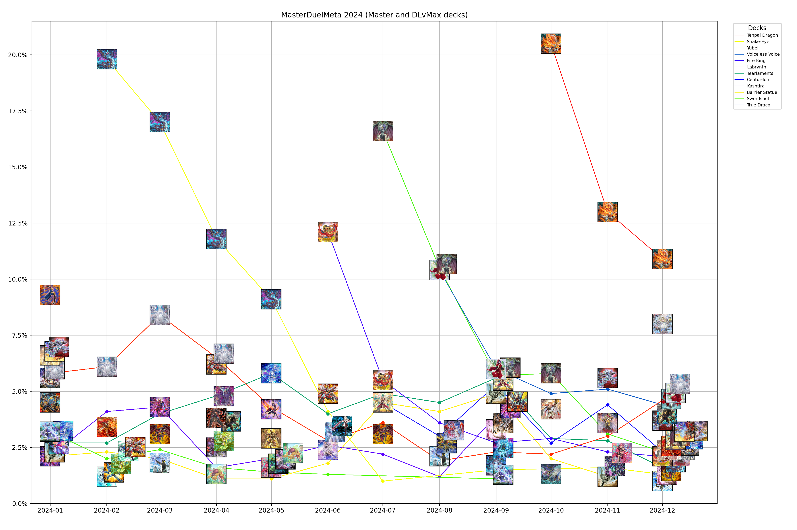
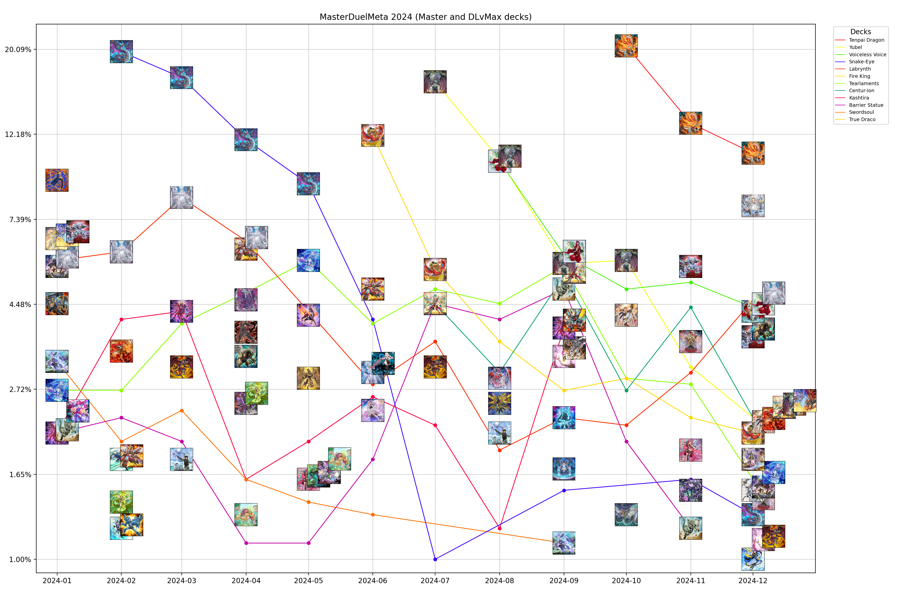

# Master Duel meta analysis

Result is a chart that show most popular decks over months.

## Steps

### 1. Get data

Data is collected from [masterduelmeta.com](https://www.masterduelmeta.com).

All past months are downloaded and saved in `downloaded_data` directory.  
Run [cmd/s1_download_top_decks](cmd/s1_download_top_decks/download_top_decks_test.go)
to re-download current month data.

### 2. List enum data

Values that Deck (Archetype), Rank, Tournament, .. can be.
Only need when start this project or some new meta decks are added.
Run [cmd/s2_list_enum](cmd/s2_list_enum/list_enum_deck_types.go) to get enum data.

### 3. Parse and save data in CSV

After parsing data, it is saved in CSV format, as a time series,
later can be visualized as a chart by Python Matplotlib.

Example data:

```csv
Month,Deck,Percent
2024-01,Superheavy Samurai,9.3
2024-01,Mathmech,6.6
2024-10,Tenpai Dragon,20.5
2024-10,Yubel,5.8
```

To do this step, run [cmd/s3_analyze_to_visualize](cmd/s3_analyze_to_visualize/s3_analyze_to_visualize.go)

### 4. Visualize data

Run [visualization/main.py](visualization/main.py)

## Chart for 2024




